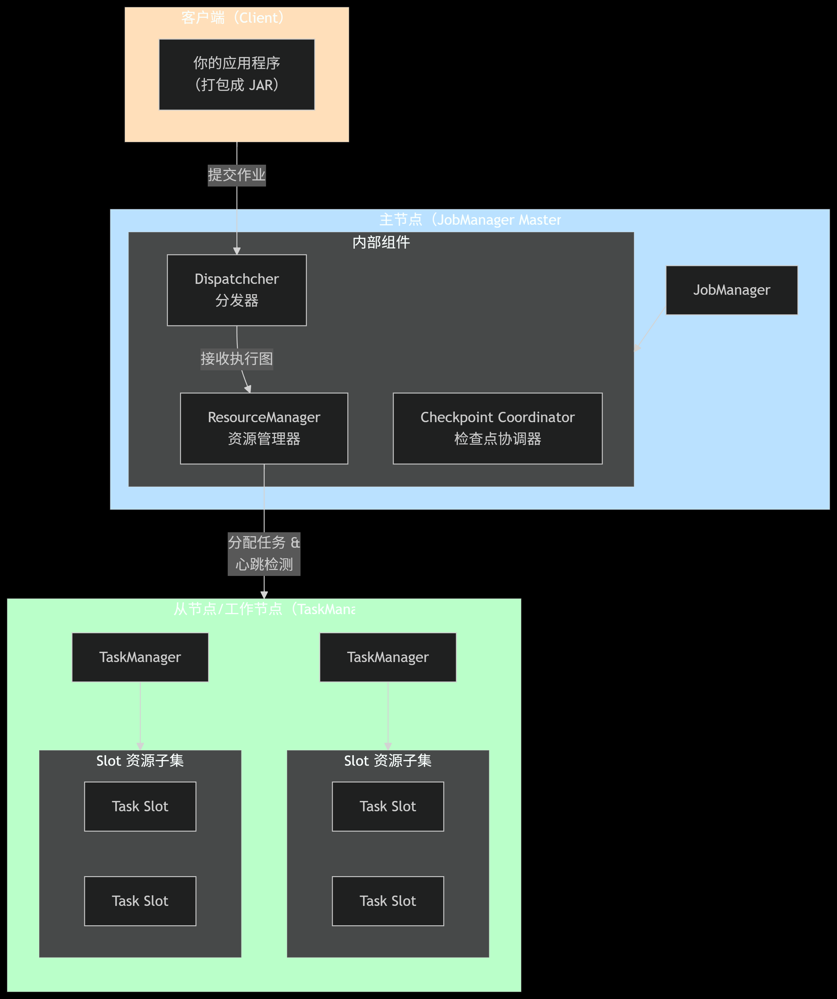

# Flink基础
### 1. Flink架构

Flink 架构是一个经典的主从（Master-Worker）架构，设计目标是支持高吞吐、低延迟、 Exactly-Once 语义的大规模分布式流处理。其核心组件如下图所示，协同工作以执行分布式数据流应用。
Flink采用经典的主从（Master-Worker）架构：JobManager作为主节点负责接收作业、调度任务、协调检查点（Checkpoint）及故障恢复；TaskManager
作为工作节点提供多个任务槽（Task Slots）执行具体任务、进行数据交换和状态存储；客户端提交作业后，JobManager将任务分配至TaskManager槽位，
并通过分布式快照机制实现容错，共同构成高吞吐、低延迟的分布式流处理系统。
___
### 2. Flink的窗口了解哪些，都有什么区别，有哪几种?如何定义?
Flink的窗口（Window）是将无界数据流划分为有限数据块进行处理的核心机制，主要分为三类：滚动窗口（Tumbling Window）（固定大小、不重叠）、滑
动窗口（Sliding Window）（固定大小、可重叠）和会话窗口（Session Window）（基于不活动间隔的动态窗口）。它们的区别主要在于窗口划分方式和重
叠性，可通过window()算子并传入相应窗口分配器（如TumblingEventTimeWindows.of(Time.seconds(5)))来定义。
```text
// 1. 滚动窗口（固定5秒）
dataStream
  .keyBy(...)
  .window(TumblingEventTimeWindows.of(Time.seconds(5))) // 事件时间
  .reduce(...);

// 2. 滑动窗口（每5秒统计一次最近10秒的数据）
dataStream
  .keyBy(...)
  .window(SlidingEventTimeWindows.of(Time.seconds(10), Time.seconds(5)))
  .reduce(...);

// 3. 会话窗口（会话超时时间5秒）
dataStream
  .keyBy(...)
  .window(EventTimeSessionWindows.withGap(Time.seconds(5)))
  .reduce(...);
```
滚动窗口：固定大小，无重叠，适用于周期性聚合（如每分钟浏览量）。  
滑动窗口：固定大小，有重叠，适用于连续统计（如每5秒更新最近10秒均值）。  
会话窗口：动态大小，基于数据活跃度，适用于用户行为分析（如用户会话划分）。  
___
### 3. Flink窗口函数，时间语义相关的问题
Flink的窗口函数依赖于特定的时间语义（由env.setStreamTimeCharacteristic()设置）来决定如何划分窗口和计算时间：事件时间（Event Time） 以数据自带的时间戳为准，结合水位线（Watermark）处理乱序事件，保证计算结果准确但延迟较高；处理时间（Processing Time） 以系统处理时刻为准，延迟最低但无法处理乱序数据；摄入时间（Ingestion Time） 是折中方案，以数据进入Flink的时间为准。窗口函数（如ReduceFunction、AggregateFunction或ProcessWindowFunction）则基于这些时间语义在窗口触发时对框选的数据进行聚合计算
___
### 4. 介绍下Flink的watermark(水位线)，watermark需要实现哪个实现类，在何处定义?有什么作用?
Flink的水位线（Watermark）是一种衡量事件时间进度的特殊时间戳，用于在乱序事件流中合理推断所有数据是否已到位；它需要实现WatermarkGenerator接口（或使用内置策略），通常在数据源或其后通过assignTimestampsAndWatermarks方法定义；其核心作用是解决乱序问题，通过设定一个允许延迟的时间阈值来触发窗口计算、保障计算结果的相对准确性，并在保证低延迟的同时实现正确性。
___
### 5. Flink的窗口(实现)机制
Flink的窗口实现机制基于分配器（Window Assigner） 和触发器（Trigger） 的协同工作：分配器负责将到达的数据元素分配到对应的窗口（如滚动、滑动或会话窗口），触发器则基于时间（事件时间或处理时间）或数据特征（如计数）决定何时触发该窗口的计算；窗口内容由状态后端(State backend) 存储，并在触发时由窗口函数（如ReduceFunction） 进行聚合处理，最后输出结果并清理窗口状态。
<br>
State（状态）是计算过程中的中间数据（如累加器的值、窗口内聚合的结果、用户会话信息），而状态后端（State Backend）是存储、访问和管理这些State的底层基础设施和策略，它决定了State存储在何处（内存、磁盘）、如何存储（Java堆、堆外、RocksDB）以及如何做容错（异步/同步快照到HDFS/S3）。

___
### 6. 说下Flink的CEP
Flink CEP（复杂事件处理）是其内置的一个库，用于在数据流中检测基于时间关系的复杂事件模式（Pattern）；用户通过定义由简单事件构成的规则序列（如“登录失败后5分钟内再次失败”），CEP引擎即可实时匹配并输出满足该模式的事件组合，广泛应用于实时风控、入侵检测和业务流程监控等场景。
___
### 7. 说一说Flink的Checkpoint机制
Flink的Checkpoint机制是其实现容错和精确一次（Exactly-Once）语义的核心：它通过周期性、异步地对分布式数据流中的所有算子状态（State）生成
全局一致性快照（包含处理位置和状态值），并将这些快照持久化到可靠存储（如HDFS/S3）中；当发生故障时，Flink可从最近一次成功的Checkpoint恢复
整个流处理作业的状态和处理位置，实现无数据丢失和状态一致性。
___
### 8. Flink的Checkpoint底层如何实现的?savepoint和checkpoint有什么区别?
Flink Checkpoint的底层实现基于Chandy-Lamport分布式快照算法：JobManager会定期向所有Source算子注入一种特殊的屏障信号（Barrier），该屏障会随着数据流向下游传播；当算子收到屏障时，会立即对自己的状态进行异步快照（写入状态后端），并将屏障广播到所有输出通道；屏障流经整个DAG图后，所有算子的状态快照组合起来即形成一个全局一致的、具有同一时间戳的检查点（Checkpoint），并最终由JobManager确认后存储到持久化系统（如HDFS/S3）中，从而保证分布式状态的一致性。
<br>
Savepoint和Checkpoint的核心区别在于目的与生命周期：Checkpoint是Flink自动周期性触发的容错机制，设计轻量且生命周期由框架管理（故障恢复后自动清理），主要用于快速故障恢复；而Savepoint是用户手动触发的全局状态快照，格式稳定且可长期保存，主要用于版本升级、代码迁移、A/B测试等有计划的操作，其本质是一次“全局Checkpoint”，但更强调操作灵活性和状态的可移植性。
___
### 9. Flink的Checkpoint流程
Flink的Checkpoint流程由JobManager周期性地触发，其核心是基于Barrier（屏障）的一致性快照机制：JobManager向Source算子注入Checkpoint Barrier，该屏障随数据流向下游广播；每个算子接收到Barrier后立即异步快照当前状态并持久化到外部存储（如HDFS），同时将Barrier传递至下游；当所有算子（包括Sink）完成快照后，JobManager确认该Checkpoint完成，从而形成一个全局一致的分布式快照点用于故障恢复
___
### 10. Flink Checkpoint的作用 
Flink Checkpoint 的核心作用是定期、异步地将分布式流处理应用的状态（State）生成快照并持久化到外部存储中，以此为基础实现故障恢复时的精确一次（Exactly-Once）语义保障，确保在发生故障后应用能自动从最近一个一致性快照点恢复状态和计算，避免数据丢失或重复处理。
___
### 11. Flink中Checkpoint超时原因
Flink中Checkpoint超时的根本原因在于Checkpoint Barrier在数据流中传播受阻，无法在规定时间内完成全局状态快照，这通常由资源不足（CPU/内存瓶颈）、反压（数据处理速度跟不上接收速度，导致Barrier排队）、外部系统交互慢（如Sink到外部API耗时过长）或状态过大（生成或持久化快照耗时）等因素引起。
___
### 12. Flink的ExactlyOnce语义怎么保证?
Flink通过分布式快照（Checkpoint）机制和两阶段提交协议（2PC） 共同保证端到端的Exactly-Once语义：Checkpoint定期对算子的状态和流处理位置进行全局一致性快照，确保故障恢复后状态与数据源重放位置一致；而对于Sink连接的外部系统，Flink通过2PC预提交（Pre-commit）和提交（Commit）阶段协调，确保数据要么原子性写入外部系统，要么在故障时回滚，从而避免重复输出。
___
### 13. Flink的端到端ExactlyOnce
Flink的端到端Exactly-Once语义通过分布式快照（Checkpoint） 和两阶段提交协议（2PC） 协同实现：Checkpoint机制周期性地对数据源读取位置、算子状态及Sink输出状态进行全局一致性快照，确保故障恢复后状态与处理进度一致；同时Sink连接器需支持2PC（如Kafka事务），在Checkpoint完成前数据处于"预提交"状态，仅当所有组件确认快照成功后才会原子性提交数据到外部系统，从而保证数据从源到目的地的精确一次处理。
___
### 14. Flink的水印(Watermark)，有哪几种?
Flink的水印（Watermark）本质上是流中插入的一种特殊时间戳，用于推进事件时间并处理乱序，主要分为周期性水印（Periodic Watermark）（根据时间或数据量间隔定期生成）和标点性水印（Punctuated Watermark）（基于特定事件触发生成）两种；前者通过assignPeriodicWatermarks定义，适用于大多数连续处理的场景，后者通过assignPunctuatedWatermarks定义，常用于依赖特殊标记事件（如数据边界）触发水印更新的场景。
___
### 15. Flink的时间语义
Flink提供三种时间语义：事件时间（Event Time） 以数据自带的时间戳为准，结合水位线处理乱序，保证结果准确性；处理时间（Processing Time） 以系统处理时刻为准，延迟最低但忽略乱序；摄入时间（Ingestion Time） 以数据进入Flink的时间为准，平衡延迟和乱序处理能力，用户可根据业务需求在环境中通过setStreamTimeCharacteristic()灵活选择时间语义。
___
### 16. Flink相比于其它流式处理框架的优点?
Flink 的核心优势在于其真正的一体化流处理架构：
它天然地将数据视为无限流，采用精准的流处理模型实现毫秒级低延迟，同时通过分布式快照机制提供端到端的精确一次（exactly-once）状态一致性保证，
并凭借轻量级容错设计和高吞吐能力，在统一的引擎上无缝支持有状态流处理、批处理甚至机器学习等多种计算范式，实现了高吞吐、低延迟与强一致性的完美平衡。
___
### 17. Flink和Spark的区别?什么情况下使用Flink?有什么优点?
Flink 是基于原生流处理理念设计的引擎，将批处理视为有界流，提供毫秒级低延迟和强一致性的精确一次处理保证，更适合实时性要求极高的场景（如实时
风控、监控告警）；而 Spark 基于微批处理（Micro-Batching）模型，通过将流数据切成小批次处理，在高吞吐的准实时场景（如分钟级ETL、日志分析）
中更具优势。<br>
因此，当业务需要亚秒级延迟、事件时间处理、有状态计算且要求端到端精确一次语义时，应选择 Flink，<br>
其优点包括真正的流式架构、低延迟高吞吐、 轻量级容错和统一的流批API。
___
### 18. Flink backPressure反压机制，指标监控你是怎么做的?
Flink 的反压（BackPressure）监控主要通过 Web UI 和特定指标来定位瓶颈。在 Flink 1.13 及之后版本，你可以直接在 Web UI 的作业拓扑图中，
通过不同颜色（如绿色表示正常，黄色表示轻度反压，红色表示重度反压）快速识别哪个算子正在承受反压。同时，Flink 提供了 busyTimeMsPerSecond、
backPressureTimeMsPerSecond 和 idleTimeMsPerSecond 这三个关键指标（它们的总和约等于 1000 ms）来量化反压的严重程度。对于更深入的分析，
可以查看 taskmanager.network.detailed-metrics 相关的详细网络指标（如输入/输出缓冲区的使用情况）.<br>
或者通过 REST API (/jobs/:jobid/vertices/:vertexid/backpressure) 获取反压采样数据。<br>
通常，反压的根源是下游算子处理速度跟不上上游发送数据的速度，这时你需要检查该算子的代码效率、是否有数据倾斜、或考虑调整其并行度。
___
### 19. Flink如何保证一致性?
Flink 通过其分布式快照算法（Chandy-Lamport） 和 两阶段提交（Two-Phase Commit, 2PC） 机制来保证端到端的精确一次（Exactly-Once）一致性：
Checkpoint 定期为所有算子的状态创建全局一致性的快照并持久化存储，确保故障恢复后状态准确；而对于外部系统（如Kafka、数据库）的精确一次输出，
则通过 两阶段提交协议 在 Checkpoint 完成后才真正提交事务，保证Sink端数据要么全部成功写入，要么在故障时全部回滚，从而实现了状态、数据流与外部系统结果的强一致性。
___
### 20. Flink支持JobMaster的HA啊?原理是怎么样的?
Flink 支持 JobManager（其核心组件包含 JobMaster）的高可用（HA），其核心原理主要依赖于分布式协调服务（如 Zookeeper 或 Kubernetes）进行领导者选举，并结合远程持久化存储（如 HDFS）来保存作业恢复所需的元数据。
<br>
当集群中存在多个 JobManager 实例时，ZooKeeper 会通过其选举机制（例如使用 LeaderLatch）确保只有一个 Leader JobManager 处于活动状态（Active），其他则处于备用状态（Standby）。活动 JobManager 会将其元数据（如 JobGraph、用户代码 jar 包、已完成的检查点信息）持久化到配置的远程共享存储（如 HDFS）中，并将这些元数据的存储位置信息记录到 ZooKeeper。
<br>
一旦活动的 JobManager 发生故障，ZooKeeper 会即时检测到并重新进行领导者选举。新选举出的 Leader JobManager 会从 ZooKeeper 中获取到之前持久化元数据的存储位置，并从远程存储（如 HDFS）中恢复这些作业状态元数据，从而接管故障 JobManager 的工作，使集群能够继续运行作业，实现高可用。
<br>
___
### 21. 如何确定Flink任务的合理并行度?
通常从数据源分区数（如 Kafka Topic 分区数） 出发作为基准，同时结合可用计算资源（如 TaskManager 的 CPU 核数） 设置初始值，再通过压测观察反压情况、吞吐量和延迟指标，逐步调整并确保各子任务间负载均衡（避免数据倾斜），最终在满足低延迟和高吞吐需求的前提下，选择一个略高于资源容量的并行度以应对流量峰值，并确保其是资源槽（Slot）数量的整数倍以实现资源高效利用。
___
### 22. Flink任务如何实现端到端一致?
Flink 通过 Checkpoint 机制和 两阶段提交（2PC） 协议共同实现端到端精确一次（Exactly-Once）一致性：Checkpoint 定期为所有算子状态创建全局一致性快照并持久化，确保故障恢复后状态准确；而对于外部系统（如 Kafka、数据库）的精确一次输出，则通过 两阶段提交 Sink 函数（如 Kafka 生产者作为事务协调者） 在 Checkpoint 完成时作为提交点，确保所有事务要么全部成功提交，要么在故障时全部回滚，从而实现了从数据源、状态处理到外部输出的全链路强一致性。
___
### 23. Flink如何处理背(反)压?
Flink 处理背压（Backpressure）采用天然的反馈机制：当下游算子（如复杂的窗口聚合）处理速度跟不上上游数据发送速率时，网络缓冲区会被填满，此压力会沿着数据流方向反向逐级传递至源头（如 Kafka Consumer），源头感知到压力后便会主动降低数据拉取或发送速率，从而形成一种自适应流量控制，避免系统内存溢出或崩溃，整个过程无需人工干预，如同在拥堵的管道中反向施加压力来调节水流。
___
### 24. Flink解决数据延迟的问题
Flink 通过其事件时间（Event Time） 和水位线（Watermark） 机制核心解决数据延迟问题：Watermark 作为一种特殊的时间戳信号在数据流中传播，标识着“该时间点之前的数据理论上已全部到达”，窗口操作会根据 Watermark 而非处理时间（Processing Time）来触发计算，同时允许设置延迟容忍度（Allowed Lateness），在此范围内的延迟数据仍可被正确处理和更新结果，从而在乱序和延迟的数据流中产生准确且具有确定性的计算 outcome。
___
### 25. Flink消费kafka分区的数据时flink件务并行度之间的关系
Flink 消费 Kafka 分区数据时，任务的并行度与 Kafka 主题的分区数直接耦合：每个 Kafka 分区最多只能被 Flink 任务中一个并行的子任务（Subtask）消费，因此 Flink 任务的最大有效并行度受限于 Kafka 主题的分区数，若 Flink 并行度小于分区数，则部分子任务需消费多个分区（可能成为瓶颈）；若并行度大于分区数，则多余子任务将处于空闲状态，造成资源浪费，故最佳实践是将 Flink 任务的并行度设置为与 Kafka 主题分区数相等，以实现资源的充分均衡利用。
___
### 26. 使用flink-client消费kafka数据还是使用flink-connector消费
必须使用 Flink-connector（如 flink-connector-kafka）来消费 Kafka 数据，因为它是 Flink 官方提供的、与 Flink 运行时深度集成的组件，支持精确一次（Exactly-Once）语义、状态容错以及与 Flink 时间模型（Event Time/Watermark）的无缝对接；而所谓的 flink-client 并非一个数据消费组件，它通常指的是提交和管理作业的客户端工具，无法直接用于消费数据流。
___
### 27. 如何动态修改Flink的配置，前提是Flink不能重启
Flink支持通过其REST API或命令行工具（CLI）动态修改部分运行参数（如并行度、Checkpoint间隔），而无需重启作业，这依赖于底层原地重启或状态复用机制；但对于需要改变作业拓扑图（如SQL逻辑）的修改，则通常仍需通过Savepoint重启或依赖外部配置中心（如Nacos）结合广播流实现动态更新。
___
### 28. Flink流批一体解释一下
Flink 的流批一体是指用同一套 API 和运行时引擎处理无界数据流（Streaming）和有界数据集（Batch），将有界数据视为一种特殊的高速流，从而实现对实时和离线计算任务的统一开发与执行。
___
### 29. 说一下 Flink 的 check 和 barrier
Flink 的 Checkpoint（检查点） 是其实现容错的核心机制，用于定期为分布式数据流应用生成全局一致的状态快照。其核心是 Barrier（屏障），
这是一种由 JobManager 注入数据流的特殊标记，它会随着普通数据记录一起向下游流动。

当算子接收到 Barrier 时，它会立即对其当前状态进行快照并将其异步持久化到稳定的存储（如 HDFS）中，然后将 Barrier 传递给下游算子。这个过程
遵循 Chandy-Lamport 分布式快照算法，确保了所有算子在同一个逻辑时间点（即同一个 Barrier 之前）的状态被捕获，从而形成一个全局一致性的快照。
当故障发生时，Flink 可以自动从最近一次成功的 Checkpoint 恢复所有算子的状态，并重置数据源到相应的位置重新消费，从而实现精确一次（Exactly-Once）的状态一致性。
___
### 30. 说一下Flink状态机制
Flink的状态（State）机制是其实现有状态流处理的核心，分为算子状态（Operator State）（与算子并行度绑定，如Kafka偏移量）和键控状态（Keyed State）
（与Key绑定，仅限KeyedStream使用，如累加器）；状态由状态后端（State Backend） 统一管理存储（内存/RocksDB）并通过检查点（Checkpoint） 
持久化到外部存储，确保故障恢复时状态一致性，支撑了窗口聚合、模式检测等复杂流处理场景。
___
### 31. Flink广播流
Flink 广播流（Broadcast Stream）是一种特殊的数据分发模式，它将一个低吞吐量的数据流（如配置、规则表） 复制并发送到下游算子的所有并行实例中，使得每个并行任务都持有全量的广播状态（Broadcast State），从而让主流（如用户行为数据流）中的每一条数据都能访问到完整的广播信息，实现动态配置更新、实时规则匹配等场景。
___
### 32. Flink实时topN
Flink 实现实时 Top N 的通用方案是：结合 Keyed Window 和 ProcessAllWindowFunction，在窗口内为每个键分配计数并进行增量聚合，最后在窗口触发时对所有键的计数进行全局排序并取出前 N 个。具体步骤如下：
<br>
数据流分组开窗：将数据流按业务键（如商品ID）分组后开窗（如滚动窗口），使用增量聚合函数（如 AggregateFunction）为每个键累积指标（如浏览量）。
<br>
全局排序取 Top N：在窗口触发时，通过 ProcessAllWindowFunction 收集所有键的计数结果，进行全局排序并输出前 N 个结果。

```text
DataStream<UserBehavior> stream = ...; // 输入数据流
DataStream<ItemViewCount> windowedData = stream
    .filter(...) // 过滤行为类型
    .keyBy("itemId") // 按商品ID分组
    .timeWindow(Time.minutes(60), Time.minutes(5)) // 定义滑动窗口
    .aggregate(new CountAgg(), new WindowResultFunction()); // 增量聚合

// 全局排序取TopN
DataStream<String> topItems = windowedData
    .windowAll(TumblingEventTimeWindows.of(Time.minutes(5))) // 全局窗口
    .process(new TopNHotItems(3)); // 取Top3

// 增量聚合函数
public static class CountAgg implements AggregateFunction<UserBehavior, Long, Long> {
    @Override
    public Long createAccumulator() { return 0L; }
    @Override
    public Long add(UserBehavior value, Long accumulator) { return accumulator + 1; }
    @Override
    public Long getResult(Long accumulator) { return accumulator; }
    @Override
    public Long merge(Long a, Long b) { return a + b; }
}

// TopN处理函数
public static class TopNHotItems extends ProcessAllWindowFunction<ItemViewCount, String, TimeWindow> {
    private final int topSize;
    public TopNHotItems(int topSize) { this.topSize = topSize; }

    @Override
    public void process(Context context, Iterable<ItemViewCount> elements, Collector<String> out) {
        List<ItemViewCount> allItems = new ArrayList<>();
        for (ItemViewCount element : elements) {
            allItems.add(element);
        }
        // 按浏览量降序排序
        allItems.sort((a, b) -> Long.compare(b.getCount(), a.getCount()));
        
        // 取TopN
        StringBuilder result = new StringBuilder();
        for (int i = 0; i < Math.min(topSize, allItems.size()); i++) {
            ItemViewCount currentItem = allItems.get(i);
            result.append("No.").append(i + 1).append(": ")
                  .append("商品ID=").append(currentItem.getItemId())
                  .append(" 浏览量=").append(currentItem.getCount())
                  .append("\n");
        }
        out.collect(result.toString());
    }
}

```
___
### 33. 在实习中一般都怎么用Flink
在实习中，Flink 主要用于处理实时数据 pipeline 的核心场景：通过消费 Kafka 等消息队列的实时数据流，进行实时 ETL 清洗转换（如日志解析、字段标准化）、基于事件时间的窗口聚合（如计算每分钟的销售额或用户活跃度）、实时风控（通过状态编程检测异常模式）以及将处理结果输出到下游系统（如数据库、大屏或另一个 Kafka Topic），从而为企业提供低延迟、高吞吐的实时数据处理能力，驱动业务决策。
___
### 34. Savepoint知道是什么吗
Savepoint 是 Flink 的一种手动触发的全局状态快照，它不仅持久化了所有算子的状态数据，还记录了作业的执行图元数据，主要用于计划内的作业停止、
版本升级、扩缩容或迁移，能够在修改代码或调整并行度后从保存点恢复状态，实现作业的优雅运维与状态版本化管理。
___
### 35. 为什么用Flink不用别的微批考虑过吗
选择 Flink 而非 Spark Streaming 等微批处理框架，主要是因为 Flink 的纯流式处理架构能提供毫秒级低延迟和真正的逐事件处理能力，无需通过微批
模拟流计算，从而在实时性要求极高的场景（如风控、监控）中具备显著性能优势。
___
### 36. 解释一下啥叫背压(BackPressure)
背压（Backpressure） 是分布式流处理系统中一种重要的流量控制机制：当下游组件的处理速度跟不上上游的数据发送速度时，系统会通过反向压力迫使上游降低生产速率，而不是丢弃数据或导致内存溢出；在Flink中，背压会通过任务间网络栈向上游传递，最终可能暂缓数据源的数据读取，从而形成一种自然的反馈调节，保障系统稳定运行。
___
### 37. Flink分布式快照
Flink 的分布式快照基于 Chandy-Lamport 算法，通过 JobManager 向数据流中周期性插入特殊标记 Barrier，当每个算子处理到 Barrier 时立即异步持久化当前状态，并逐级向下游传递 Barrier，最终全局所有算子在同一个 Barrier 边界完成状态快照，形成全局一致性的检查点（Checkpoint），用于故障恢复时实现精确一次（Exactly-Once）语义保证。
<br> 
可以自行了解一下chandy-Lamport算法

___
### 38. Flink SQL解析过程
Flink SQL 的解析过程遵循标准 SQL 处理流程：首先通过 SQL Parser 将输入的 SQL 字符串解析为抽象语法树（AST），然后由 Validator 结合 Catalog 中的元数据进行验证和语义分析，接着通过 Logical Planner 生成初始逻辑执行计划并应用优化规则（如谓词下推、投影裁剪）生成优化后的逻辑计划，最后由 Executor 将逻辑计划转换为可执行的 Flink DataStream/DataSet 作业图，并交由底层运行时引擎调度执行。
<br>
这个可以去了解一下普通SQL的解析过程。 
___
### 39. Flink on YARN模式
Flink on YARN 模式是指 Flink 集群作为 YARN 生态中的一个应用（Application）运行，由 YARN 的 ResourceManager 统一负责资源分配和调度：当 Flink 作业提交时，YARN 会首先启动 Flink JobManager 的 ApplicationMaster，再由 ApplicationMaster 向 YARN 申请容器（Container）来启动 TaskManager 实例，从而实现与 Hadoop 集群共享资源、统一管理，并充分利用 YARN 的弹性资源分配和高可用机制。
___
### 40. Flink如何保证数据不丢失
link 通过其基于 Chandy-Lamport 算法的分布式快照（Checkpoint）机制保证数据不丢失：JobManager 定期向数据流中注入屏障（Barrier），当每个
算子处理到 Barrier 时会异步持久化自身状态到可靠存储（如 HDFS），同时数据源（如 Kafka）会记录快照对应的偏移量；当故障发生时，Flink 自动从
最近一次成功的 Checkpoint 恢复，并让数据源重置到记录的偏移量重新消费，从而实现状态精确一次（Exactly-Once） 和数据零丢失。
___
### 41. flink的state backend。
StateBackend 决定了 State 的存储位置和访问方式，以及在 Checkpoint 时状态数据如何持久化及存储到哪里。
<br>
Flink 提供了三种主要的 StateBackend：<br>
Flink 中 StateBackend（状态后端）决定了状态数据在运行时如何存储以及在做检查点（Checkpoint）时如何持久化。
它主要分为三类：<br>
MemoryStateBackend 将状态存储在 TaskManager 堆内存中，检查点保存在 JobManager 内存，仅用于测试；<br>
FsStateBackend 将状态存储在堆内存中，但检查点持久化到远程文件系统（如 HDFS），适用于常规状态作业；<br>
RocksDBStateBackend 将状态存储在本地磁盘的嵌入式 RocksDB 数据库中，检查点也持久化到远程文件系统并支持增量检查点，专为超大数据量状态而设计，是生产环境最常见的选择。<br>

可以通过代码或在 flink-conf.yaml 配置文件中指定 StateBackend
___

