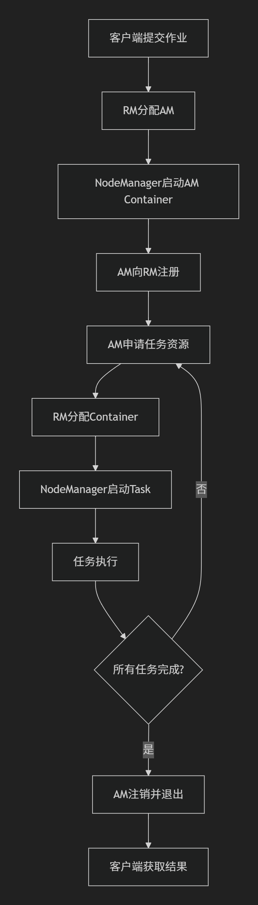

# Hadoop基础

1. 介绍一下Hadoop。
   Hadoop是一个开源的分布式计算框架，主要是用于处理大规模数据集的存储和计算，核心组件包括：  
- HDFS(Hadoop Distributed File System) : 分布式文件系统，将大文件，默认为128MB分块并跨多台机器存储，通过数据冗余（默认3副本）确保高容错性，主节点NameNode主节点管理元数据，从节点DataNode存储实际数据块。
- MapReduce:并行计算框架，Map代表数据分片处理，Reduce代表结果汇总，属于两个阶段，适合批处理任务。
- YARN：是资源调度系统，负责集群分配和多任务调度，支持同时运行多个应用程序，比如说Hive和Spark。

但是用户使用 Hadoop 的时候，看到的是一个文件系统，比如说要获取 hdfs/tmp/file1 的数据，引用的是一个文件路径，但是实际的数据存放在很多个不同的机器上，对用户透明。
___
2. Hadoop 的设计特点
- 适合大数据文件： 非常适合 T 级别的大文件或者一堆数据文件的存储，如果文件只有几十 GB 或者更小就不大适用；假设 HDFS 中块儿的大小为 64MB，备份数量为 3，那么一般情况下，一条元数据记录需要占用 200B 的内存，那么对于 1GB 的大文件，将占用 1GB/64MB ✕ 3 个文件块；对于 1024 个 1MB 的小文件，则占用 1024✕3 个文件块。因此，存储同等大小的文件，单个文件越小，所需要的元数据就越大，占用的内存就越大，因此适合存储大文件。另外，Spark 通常需要将数据拆分成多个小任务（逻辑分片默认为 64MB）并行处理，如果分片过大则会增加调度开销。
- 文件分布式存储：HDFS 会将一个完整的大文件平均分块存储到不同计算器上，它的意义在于读取文件时可以同时从多个主机上面读取不同区块的文件，多主机读取比单主机读取要快的多。
- 流式数据访问：一次写入多次读写，这种模式和传统文件不同，并不支持动态改变文件内容，而是要求让文件一次写入就不做变化，要变化也只能在文件末尾添加内容，通过流式的数据访问来保证高吞吐量。
- 数据靠拢：对数据进行计算时，采用的是计算像数据靠拢的方式，即选择最近的数据进行计算，减少数据在网络中的传输延迟。
- 高可靠性：HDFS 认为所有的主机都会出现问题，为了防止某个主机失效而导致读取不到该主机上面的块文件，将同一个文件副本分配到其他某几个主机上，如果一台主机失效，将迅速找另一个副本读取文件。
- 高可用性：2.0 之前，NameNode 只有一个，存在单点问题（也就是单点问题导致的整个集群都不可用，虽然 Hadoop1.0 有 secondaryNameNode，CheckPointNode， BackupNode 这些来尽量满足 HA，但是单点问题依然存在），在 Hadoop2.0 引入了新的 HA 机制，集群会同时运行两个 NameNode，一个座位活动的 NameNode（Active），一个作为备份的 NameNode（Standby）；备份的 NameNode 的命名空间与活动的 NameNode 是实时同步的，所以当活动的 NameNode 发生故障而停止服务的时候，备份的 NameNode 可以立即切换为活动状态，而不影响 HDFS 集群服务。
- 最终一致性： HDFS 是一个松散的一致性检查的模型，它主要是为了追加（append）操作而不是覆盖重写，因为覆盖重写的话可能在一次读的操作会读到其他副本不一致的数据，而追加操作中，其中一个的副本的不一致也不会导致客户端读到不一致的数据；同时 HDFS 在追加操作时采用 Lease 机制，即将块的写操作权授权给主块服务器（primary chunk server)，另外的副本称之为次块服务器（secondary chunk server），当多个客户端并发写操作时候，主块服务器缓存其写的顺序，之后联系次服务器进行追加操作。
___

3. Hadoop 不适合的场景
- 低延时的数据访问：对延时要求在毫秒级别的应用，不适合采用 HDFS，HDFS 是为高吞吐数据传输设计的，因此 HBase 更适合低延时的数据访问。
- 大量小文件也不适合，文件的元数据保存在 NameNode 的内存中，整个文件系统的文件受限于 NameNode 的内存大小，经验而谈，一个文件/目录/文件块一般占有 150 字节的元数据内存空间，如果有 100 万个文件，每个文件占用 1 个文件块，则需要大约 300M 的内存，因此上一级别的文件数量在现有的商用机器上难以支持。
- 对方读写：HDFS 采用的是追加 append-only 的方式写入数据，不支持文件任意 offset 的修改（其中，文件中的地址与内存中的地址表示不同，使用偏移量File Offset 来表示），不支持多个写入器（writer）。
___
4. Hadoop主要分为哪几个部分？他们有什么作用？  
   前面问题 1 中已经提及
___
5. Hadoop1.x 2.x 3.x 的区别。
-  1.x 版本的时候采用的还是 master/slave 模式，JobTracker 承担双重核心职责，资源管理和作业调度。这种设计导致 JobTracker 成为性能瓶颈，仅能支持约 4000 节点集群，且 MapReduce 与 HDFS 强耦合，无法扩展其他计算框架。
-  2.x 版本引入 YARN，将资源管理与作业调度进行了分离，REsourceManager 负责全局资源分配（基于容器 Container），ApplicationMaster（每个应用独立拥有）负责具体的任务的调度和监控，架构解耦后，可以支持多计算框架（MapReduce、Spark、Flink 等）运行。
-  3.x 版本延续 YARN 的分离式架构，记忆不优化资源模型--支持用户定义资源类型。3.x 提升解决 2.x 的可伸缩问题。
   
逐步升级了高可用性、存储效率。还有资源管理方面的差别。
___
6. Hadoop集群工作时启动哪些进程?它们有什么作用?
- HDFS核心进程： 
    
| 应用进程名称              | 作用                                                                                                                                                                               | 
|---------------------|----------------------------------------------------------------------------------------------------------------------------------------------------------------------------------| 
| NameNode            | 是 HDFS 的主服务器，核心功能是管理文件系统的元数据，它处理客户端的读写请求，记录每个文件的数据块分布信息。元数据以fsimage(命名空间快照）和 edits(操作日志）形式持久化到本地磁盘。                                                                              |  
| DataNode            | 是 HDFS 的工作节点，负责存储实际数据块，默认大小为 128MB。它执行客户端或者 NameNode 调度的数据读写操作，并定期向 NameNode 发送心跳信号和块报告。                                                                                         |  
| secondaryNameNode   | 辅助名称节点，不是 NameNode 的热备，而是元数据辅助管理进程，其核心任务是定期合并 NameNode 的 edits 日志和 fsimage 文件.                                                                                                   |  
| seconaryNameNode(续) | 从 nameNode 下载 fsimage 和 edits，合并后生成新的 fsimage 并上传至 NameNode，替换旧文件。此举可以防止 edits 日志过大（避免 NameNode 重启时好时过长）。合并后的fsimage需由NameNode主动加载，SecondaryNameNode故障不会影响集群运行，但会增加NameNode恢复时间。 |  

- YARN 核心进程

| 应用进程名称            | 作用                                                                                                                                                                                                                  | 
|-------------------|---------------------------------------------------------------------------------------------------------------------------------------------------------------------------------------------------------------------|  
| ResourceManager   | 资源管理器 是 YARN 的**全局资源管理器**， 负责整个集群的资源(CPU,内存，GPU等)分配与调度。它由两部分组成。 (1) **Scheduler**，根据资源需求和队列策略（比如 FIFO）分配容器（Container）  (2) ApplicationsManager（应用管理器），管理应用程序的生命周期，提交、启动、监控、终止等，协调 ApplicationMaster 的运行 | 
| NodeManager       | 节点管理器 YARN的单节点资源管理者，运行在每个集群节点上。其主要职责包括： ① 管理节点上的资源，如 CPU、内存等 ② 启动和监控容器（Container， YARN 的资源分配单位，封装了 CPU、内存等资源）；③定期向 ResourceManager 发送心跳（汇报节点资源使用情况和容器运行状态）； ④ 接收 ApplicationMaster 的指令，如启动、停止任务等。   | 
| ApplicationMaster | 应用管理器 每个应用程序（MapReduce、Spark）的独立管理进程。由 ResourceManager 启动，负责应用程序的具体执行： ① 向ResourceManager申请资源(Container); ② 协调Container的执行(如启动MapTask、ReduceTask); ③ 监控任务进度（如任务失败时重新申请资源并重启）； ④ 向ResourceManager汇报应用完成状态；      | 
___

7. 在集群计算的时候，什么是集群的主要瓶颈。
- 数据倾斜问题，集群计算中热点key的存在，或或者说 key 分布不均匀，某些节点或者分片就会被频繁访问，导致局部 CPU、内存或者 I/O资源耗尽，形成热点瓶颈。
- 内存不足瓶颈, 任务集群出现最多的问题都是GC 问题和 OOM 问题，集群会在夜里报警，大多数都是 GC 问题，加资源都可以解决。
- 计算资源瓶颈，例如在 Spark 集群中，如果 Driver 运行在集群模式，且所在节点资源不足，改节点可能成为整个集群的瓶颈点，影响整体计算调度与任务执行。
- 存储 I/O 与文件系统瓶颈， 文件系统的管理效率，I/O带宽、文件创建/删除等操作，尤其在分布式存储集群中，尝尝成为性能瓶颈。
- 任务调度与元数据管理瓶颈， 在大规模集群尤其是分布式存储与计算分离架构中，元数据管理（比如分片映射、节点调度、文件系统 Client 的调度等）也可能成为瓶颈。
___

8. 搭建Hadoop集群的xml文件有哪些?
（个人认为这个问题不会是面试常问的问题，怎么可能会有面试官问这种问题呢？）
不同的 Hadoop 组件有不同的配置文件：  
（·）核心配置文件（所有的 Hadoop 组件共用）core-site.xml,用来定义 Hadoop 的基础配置，比如 HDFS 的默认文件系统地址、Hadoop 的临时目录等。通常是配置 HDFS 的默认文件系统地址、Hadoop 临时目录等。  
（··）HDFS专属配置，hdfs-site.xml，配置HDFS（Hadoop 分布式文件系统）的相关参数，如 NameNode 数据存储目录、副本数、高可用配置等等。  
（···）YARN 配置文件，yarn-site.xml，配置YARN 的资源管理相关参数，比如说 ResourceManager 地址、NodeManager 配置、容器资源分配等。  
（····）MapReduce配置文件，计算框架的，mapred-site.xml,配置计算框架的运行模式。  

___
9. Hadoop的checkpoint流程。
Hadoop的checkpoint机制主要是为了维护HDFS文件系统的元数据一致性。防止因 NameNode 故障导致的数据丢失。Checkpoint 主要通过 Secondary NameNode（在 Hadoop 2.x 及以后的版本中，这个角色可以由 Checkpoint Node 或 Standby NameNode 承担）来实现。 \
工作流程如下：   
① 编辑日志： NameNode在执行文件系统操作时候，会将这些操作记录在编辑日志中，编辑日志是一个日志文件，记录了所有对文件系统元数据的更改。
② FsImage：FsImage 是文件系统元数据的快照，包含了文件系统在某个时间点的状态。
③ 定期合并：Secondary NameNode 定期从 NameNode 获取编辑日志和 FsImage，并将编辑日志中的操作应用到 FsImage 上，生成一个新的 FsImage 文件。这个过程称为 Checkpoint。
④ 上传新 FsImage：新的 FsImage 文件会被上传回 NameNode，替换旧的 FsImage 文件。这样，NameNode 就有了最新的文件系统元数据快照。
⑤ 清空编辑日志：NameNode 在接收到新的 FsImage 后，会清空编辑日志，以减少日志文件的大小。
可参考：https://cloud.tencent.com/developer/article/2490873
___
10. Hadoop的默认块大小是多少?为什么要设置这么大?
默认大小是128MB，设置这么大，不大不小，不小是为了减少NodeName内存开销，NameNode需要再内存中存储每个块的元数据，大约是150B/块。块大小跟NameNode的内存的消耗成反比，较大的块支持更大规模的集群扩展。  
寻址时间： 从HDFS中找到目标块所需要的时间，文件块越大寻址时间越短，但是传输时间越长，处理某个块的时间受这两方面影响，太大太小都会导致处理时间变慢.
另外，MapReduce中的map任务每次只能处理一个block的任务，块太大运行速度会很缓慢，但是太小又占NameNode内存.因此设置块大小最后使得寻址时间为传输时间的1%最好，所以定下来128MB，当然传输速度越快，块大小还可以增大。
可参考：https://blog.csdn.net/wx1528159409/article/details/84260023
___
11. Block划分的原因.
将Hadoop划分为Block数据块石分布式存储与计算的核心设计。
主要是为了提升读写性能，化整为零，将大文件切分为固定大小的Block，那么多个节点可以同时读取不同的Block，显著提升吞吐量，比单点更快，同时也分担了I/O压力。
Block通过多副本进行容错、同时可以将副本分散至各个节点，可以优先选择负载较低的节点读取数据，避免节点分散或者限制，
___
12. Hadoop常见的压缩算法?
直接看吧：https://blog.csdn.net/2302_77630591/article/details/134084911
___
13. Hadoop作业提交到YARN的流程?
Hadoop作业提交到YARN的流程是一个多步骤的协作过程，涉及到客户端、ResourceManager、NodeManager和ApplicationMaster等组件的交互。
  

| STEP      | 操作                                                                                               | 作用or目的                                                                           |
|-----------|--------------------------------------------------------------------------------------------------|----------------------------------------------------------------------------------| 
| 提交作业      | 提交作业，将作业资源上传到HDFS的指定目录                                                                           | 向ResourceManager（RM）申请一个唯一的作业ID，并获取资源提交路径。                                       |
| 分配资源      | （RM）收到作业提交后，为其分配一个ApplicationMaster（AM）进程，RM将AM的启动命令发送给一个NodeManager                             | NodeManager启动一个Container来运行AM（对于MapReduce作业，即MRAppMaster），并初始化作业状态               |
| AM注册与资源请求 | AM启动后向RM注册自身，根据作业需求（如Map任务数量）向RM申请资源（Container），包括内存、CPU等                                        | 以便RM跟踪作业状态,以及申请资源                                                                | 
| 资源分配与任务启动 | RM根据调度策略（如Capacity Scheduler或Fair Scheduler）分配Container给AM。Container是YARN的资源单位，运行在NodeManager上   | AM与NodeManager通信，在分配的Container中启动Map或Reduce任务。任务执行时从HDFS读取输入数据，处理后将结果写入HDFS或本地磁盘 |
| 任务监控与完成   | AM持续监控任务进度和状态。若任务失败，AM会重新申请资源并重试（次数有限制）                                                          | 所有任务完成后，AM向RM注销并关闭，客户端获取作业结果                                                     |  
___
14. Hadoop的Combiner的作用.
Hadoop中的Combiner是MapReduce框架中的一种优化组件，主要用于在Map阶段和Reduce阶段之间对数据进行局部聚合，以减少数据传输量并提升作业性能.  
减少数据传输量: Combiner在Map任务所在的节点上对相同Key的中间结果进行局部聚合（如求和、计数等），显著减少需传输到Reduce端的数据量。例如，在WordCount任务中，Map输出(hello,1)和(hello,1)可合并为(hello,2)，从而降低网络带宽消耗和磁盘I/O压力。 
优化Shuffle性能: 通过压缩Map输出数据量，Combiner减轻了Shuffle阶段的负载，避免因大量数据传输导致的网络拥塞，尤其对数据倾斜场景（如少数Key对应大量Value）效果显著。  
降低Reduce任务负载: Reduce任务接收的数据量减少后，处理速度更快，资源消耗更低，整体作业效率提升. 

Combiner在以下两个阶段触发：  
Map任务溢写（Spill）时: 当Map输出的内存缓冲区达到阈值并溢写到磁盘前，对分区内数据进行合并。
Map任务结束时: 所有溢写文件归并时再次执行Combiner.
Combiner仅处理单个MapTask的输出，无法跨节点或跨Map任务聚合数据。其输入/输出键值类型必须与Map的输出和Reduce的输入一致.

___
15. Hadoop序列化和反序列化.
Hadoop的序列化和反序列化是其分布式计算框架中的核心机制，用于高效处理数据在网络传输和磁盘存储中的转换。
序列化：将内存中的对象转换为字节流，以便存储或传输。   
反序列化：将字节流还原为内存中的对象。  
Hadoop采用Writable接口替代Java原生序列化（Serializable），原因包括:
- 高效性：Writable生成的字节流更紧凑（如IntWritable仅需4字节，而Java序列化可能包含额外元信息），减少存储和传输开销
- 性能优化：支持对象复用（通过readFields方法修改现有对象状态，避免频繁创建新对象），降低GC压力
- 跨平台兼容：二进制格式不依赖特定语言或操作系统
___
16. Hadoop的运行模式.
- 本地模式（Local/Standalone Mode）： 所有的程序运行在单个JVM中，不需要启动任何的守护进程，比如说NameNode、DataNode等。
使用本地文件系统而不需要使用HDFS，适合快速调试MapReduce程序逻辑。
- 伪分布式模式（Pseudo-Distributed Mode）：可以再单个机器上模拟多节点集群，启动所有的Hadoop守护进程（NameNode等），但是实际上在同一台主机上,
因为是单机模式，所以无备份，但是依然要配置核心xml文件。适合测试。
- 完全分布式模式（Fully Distributed Mode）：生产环境中的所用模式。

可以参考: https://developer.aliyun.com/article/1601955
___
17. Hadoop小文件处理问题.
Hadoop小文件问题是指大量远小于HDFS默认块大小（如128MB）的文件对集群性能和资源管理造成的负面影响。  
- 每个文件在NameNode中占用约150字节的元数据，100万个小文件将消耗约300MB内存，导致NameNode内存不足，甚至触发Full GC，影响集群扩展性,
元数据过多还会降低文件寻址速.  
- MapReduce中，每个小文件会生成独立的Map任务，任务启动时间（约30秒）可能超过数据处理时间（如1MB文件处理仅需2秒），造成资源浪费;
Hive查询可能出现“Map端负载倾斜”，部分Task处理数据量远低于平均值.
- 小文件实际存储量=数据大小+块元数据开销。例如，1KB文件在128MB块配置下仍占用128MB HDFS空间

解决方法： 
- 从源头预防： 使用kafka或者Flume的时候，通过滚动策略控制文件大小，比如按照时间或者大小切割。
- Hive动态分区优化，限制动态分区数量，避免分区过多产生小文件；  
- 在存储层优化，将多个小文件打包成单个HAR文件，减少NameNode元数据条目，访问时通过har://路径透明读取。
- 计算层优化: 合并多个小文件为一个逻辑分片，减少Map任务数量。
___
18. Hadoop为什么要从2.x升级到3.x?
不知道，2有缺点吧，但是现在学习标准还是从2来的
为什么？ https://www.iamshuaidi.com/47052.html
有什么升级？ https://www.cnblogs.com/bigband/p/13520760.html
___
19. Hadoop的优缺点。
优点： 高可靠、高扩展、成本低、高容错、支持多种数据类型
缺点：实时性不行、小文件处理效率低、不支持多用户写入及任意修改、配置管理复杂。
___