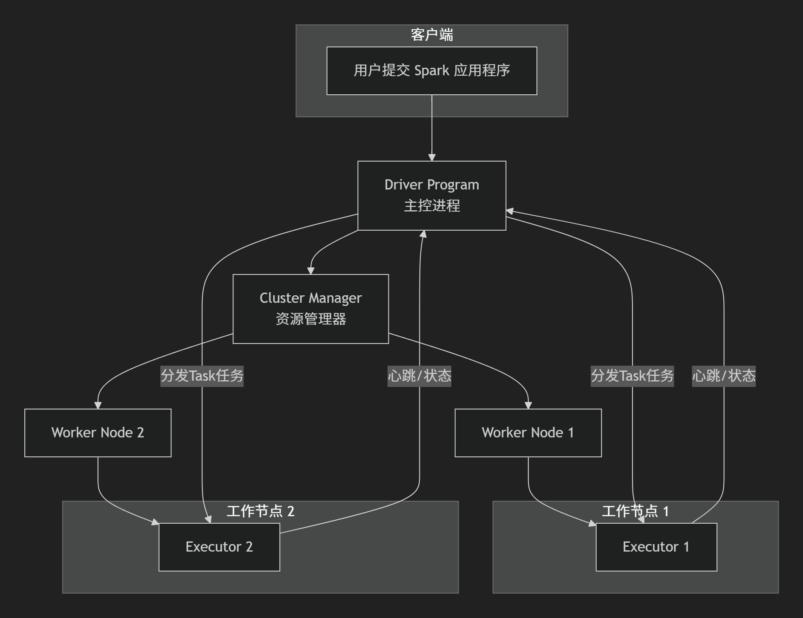
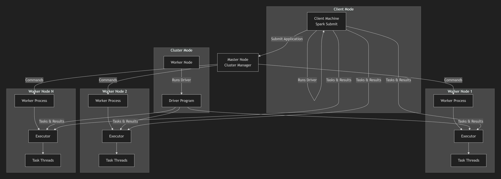

# Spark基础
### 0.spark的一些基本概念
|       |                                                                   | 
|-------|-------------------------------------------------------------------|
| RDD   | 弹性分布式数据集，是 Spark 中最基本的数据抽象，代表一个不可变、可分区的分布式数据集合，具备内置的容错机制          |
| DAG   | 有向无环图，Driver会将Spark任务转换成一个DAG，其中顶点是RDD，边是转换                       |
| Job   | 一个Action算子，（如collect(), saveAsFile())会触发一个Job，一个Job对应一个DAG        |
| Stage | Stage是Job的调度单位，DAGScheduler会根据RDD之间的宽依赖（Shuffle依赖）将DAG划分成多个Stage。 |
| Task  | Task是Stage的执行单位，代表在一个数据分区上进行的计算。一个Stage会启动多个Task在各个Executor上并行执行。 |

### 1. Spark的任务执行流程

| 流程                     | 说明/关键操作                                                                                              | 
|------------------------|------------------------------------------------------------------------------------------------------|
| 应用启动:Driver初始化与环境准备    | Spark应用的起点是创建 SparkContext（每个应用的唯一入口），它负责与集群管理器（YARN、Standalone）通信，完成下面关键操作                          |
|                        | 向集群管理器注册应用，申请 Executor 资源（指定 CPU、内存大小等）                                                              |
|                        | 解析用户代码(比如说 RDD 转换/行动操作，为后续执行计划构建做准备                                                                  |
|                        | 维护应用的全局状态（如任务进度、资源使用情况）。                                                                             |
| 构建DAG:逻辑执行计划生成         | 用户通过RDD的转换操作（如map、filter、join）定义数据处理逻辑，这些操作会被Spark记录为RDD依赖链（如RDD A→RDD B→RDD C）。随后，Spark将依赖链转换为DAG   |
|                        | 节点： 达标一个 RDD（或者 RDD 的分区）；                                                                            |
|                        | 边：代表RDD间的依赖关系（分为窄依赖（如map,父RDD分区与子 RDD 分区一对一）） 和宽依赖（如groupByKey，父RDD分区与子RDD分区多对多））。                   |
|                        | DAG是 Spark 优化的基础，它能识别可并行执行的任务，并避免不必要的计算(如缓存中间结果)。                                                    |
| Stage划分：物理执行计划拆分       | DAG会被DAGScheduler根据宽依赖拆分为多个Stage（阶段），拆分规则如下                                                          |
|                        | 窄依赖：属于同一Stage，可并行执行（如RDD A→RDD B→RDD C的窄依赖链为一个Stage）；                                                |
|                        | 宽依赖：作为Stage边界（如RDD B→RDD C的宽依赖，RDD B的处理为一个Stage，RDD C的处理为下一个Stage）。                                  |
|                        | 每个Stage包含多个Task（任务），Task是最小执行单元，数量等于对应RDD的分区数（如RDD有10个分区，则该Stage有10个Task）。                           |
| 任务调度：Task分配与执行         | TaskScheduler将每个Stage的Task打包为TaskSet（任务集），并根据数据本地性（Data Locality）策略分配给Executor;                      |
|                        | 数据本地性优先：尽量将Task分配给存储有其处理数据的节点（如HDFS block所在节点），减少网络传输；                                               |
|                        | 资源匹配：根据Executor的资源（CPU、内存）情况，分配合适数量的Task（如每个Executor分配2个CPU核心，则每个核心可同时运行1个Task）；                     |
|                        | 失败重试：若Task执行失败（如Executor崩溃），TaskScheduler会重新分配任务（默认重试4次）。                                            |
|                        | Executor接收到Task后，启动线程执行Task，处理对应分区的数据（如执行map函数的逻辑）。                                                  |
| 数据Shuffle：跨Stage数据重新分布 | 当Stage间存在宽依赖（如groupByKey、reduceByKey）时，需要触发Shuffle操作，目的是将数据按照新的分区规则（如key的哈希值）重新分布到下游Stage的Executor中。 |
|                        | Map端：将数据按照分区规则排序、分区，并写入本地磁盘（生成多个临时文件）；                                                               |
|                        | Reduce端：从Map端拉取对应分区的数据，合并、排序后进行处理（如reduceByKey的聚合操作）。                                                |
|                        | Shuffle是Spark的性能瓶颈之一，涉及大量网络传输和磁盘I/O，因此需通过调参（如spark.shuffle.spill.compress=true开启压缩）优化。               |
| 结果收集与处理：最终结果返回         |                                                                                                      |
|                        | 行动操作触发：当遇到行动操作（如collect、count、saveAsTextFile）时，下游Stage的Task开始执行，处理后的结果会返回给Driver；                    |
|                        | 结果聚合：Driver收集所有Task的结果（如collect将所有分区数据汇总到Driver内存），并根据操作类型处理（如count返回总数，saveAsTextFile将结果写入HDFS）；    |
|                        | 结果输出：最终结果可通过控制台打印、存储到外部系统（如Hive、MySQL）或传递给后续应用。                                                      |
| 应用结束：资源释放与清理           | 当所有Task执行完成且结果处理完毕后                                                                                  |
|                        | 通知集群管理器释放Executor资源（停止Executor进程，释放CPU、内存）；                                                          |
|                        | 关闭SparkContext，终止与应用相关的所有连接（如与集群管理器的通信、与Executor的心跳）。                                                |
|                        | 此时，应用生命周期结束，集群资源可被其他应用复用。                                                                            |
以上流程体现了Spark的并行计算（Task分布在多个Executor上）、容错机制（RDD lineage血统恢复数据）、资源优化（数据本地性、Stage拆分）等核心优势，使其能高效处理大规模数据。
___
### 2. Spark的运行流程
这个跟任务执行流程没啥区别吧。

___
### 3. Spark的作业运行流程是怎么样的?
重复了喂！

___
### 4. Spark的特点
① 速度快；
- 首先是基于内存计算，中间计算结果尽可能的保存在 RAM 中，并不是想 Hadoop MapReduce那样频繁读写磁盘，从而大幅度减少 I/O开销，提高计算速度。
支持 RDD 的缓存(cache()/persist())，对于迭代计算（比如机器学习、图计算）的交互式查询尤其高效。
- DAG 执行引擎，Spark使用 DAG 对用户的计算逻辑进行优化，将多个操作合并成一个执行计划，避免不必要的 Shuffle 和重复计算，提高执行效率。
通过 DAGScheduler和 TaskScheduler 实现高效的调度和任务切分。  
- 优秀的 Shuffle 与任务调度机制
Spark 对 Shuffle 过程进行了优化，支持多种压缩和序列化方式，减少网络与磁盘开销。？？支持推测执行，对执行慢的 Task 会启动备份任务，提高整体作业完成速度。？？

② 通用性强  
支持读取和写入 HDFS、Hive、Kafka、HBase、MySQL、JSON、Parquet、ORC 等多种数据源和格式，具备强大的数据集成能力。  

③ 容易使用  
提供了更丰富的更高级易用的编程模型，比如RDD，支持 map、filter、reduce、join等函数式操作；DataFrame/DataSet：类似于 SQL 表或者 pandas DataFrame，
支持结构化处理。还可以直接使用 SQL 进行查询。Java、Python、Scala 都有 API。  

④ 容错性强  
⑤ 可扩展性高，支持大规模集群，跟多种集群管理器兼容，Standalone（spark自己的）、YARN（常用的Hadoop的）。  
⑥ 支持流批一体，可以支持流式处理也支持批处理、但是在我们组，一般将流式任务处理交给 flink。  

___
### 5. Spark源码中的任务调度
Spark 的任务调度是其分布式计算的核心组件之一，负责将用户提交的作业（job）拆解为可执行的子任务（Task），并通过资源管理器将任务分配到集群中的 Executor
上面执行，其调度机制主要分为 Stage 级的调度（DAGScheduler 负责）和 Task 级别的调度(由 TaskScheduler 负责)两部分，两者协同工作以实现高效的并行计算。

- Stage级调度（DAGScheduler）
是 Spark 任务调度的高层组件，主要负责将用户提交的作业（Job）转换为 Stage DAG（有向无环图），并按照宽依赖划分为Stage，最终将每个 Stage的任务集（TaskSet）
提交给 TaskScheduler 执行。  
> Job 和 Stage 的划分
> Job触发条件： Spark 采用惰性计算模式，只有当遇到 Action 算子（比如 collect、count、saveAsTextFile）时，才会触发 Job 的提交。此时，SparkContext
> 会将 Job 交给 DAGScheduler 处理。 
> 
> Stage划分逻辑： DAGScheduler 会根据 RDD 的依赖关系（dependencies）构建 DAG。具体来说，它会从 Action 触发的最终 RDD 开始，反向回溯其依赖项：  
> 如果遇到了窄依赖，比如 map、filter，则将当然 RDD 与父RDD 合并到同一个 Stage（因为窄依赖可以在同一个节点上流水线执行，无需 shuffle）；  
> 如果遇到了宽依赖，则以该宽依赖为边界划分 Stage（因为宽依赖需要 Shuffle，必须等待上有 Stage 完成才能执行）。  
> 
>> 举个例子，对于WordCount作业，（textFile → flatMap → map → reduceByKey → saveAsTextFile），DAGScheduler会划分两个Stage   
> ShuffleMapStage（处理textFile → flatMap → map）：为下游Stage准备Shuffle数据；   
> ResultStage（处理reduceByKey → saveAsTextFile）：由Action算子触发，生成最终结果。  
> 
> TaskSet 的生成与提交
> Task生成：每个Stage会生成一组Task（ShuffleMapTask或ResultTask），数量等于对应RDD的分区数（partitions.size）。
>> ShuffleMapTask：负责将数据写入本地磁盘（Shuffle输出），供下游Stage读取；  
>ResultTask：负责处理最终数据（如saveAsTextFile），生成Action结果。
> 
> TaskSet封装：DAGScheduler会将同一Stage的所有Task封装为TaskSet（包含Task的二进制代码、分区信息、数据本地性等），并通过submitStage方法提交给TaskScheduler。

- Task级调度（TaskScheduler）
TaskScheduler是Spark任务调度的底层组件，主要负责将DAGScheduler提交的TaskSet分配到Executor上执行，并监控任务的运行状态（如成功、失败、重试）。
> TaskSetManager的作用  
> TaskScheduler会将每个TaskSet封装为TaskSetManager（TaskScheduler的内部类），用于管理TaskSet的生命周期：
>> 任务分配：TaskSetManager会根据Task的数据本地性（preferredLocations，如RDD分区所在的Executor或节点）和调度策略（如FIFO、Fair），将Task分配给SchedulerBackend（资源调度接口）;    
>  状态监控：TaskSetManager会监听Task的执行状态（通过SchedulerBackend接收Executor的心跳），若Task失败，会根据重试策略（spark.task.maxFailures，默认4次）重新提交任务；
> 若重试次数超过阈值，则标记Stage为失败，触发DAGScheduler重新提交Stage。   
> 
> 调度策略  
> TaskScheduler支持两种主要的调度策略，通过spark.scheduler.mode参数配置：  
>> FIFO（先进先出）：默认策略，先提交的Job优先分配资源，同一Job内的Task按Stage顺序执行。适用于批处理作业，保证作业的执行顺序;   
>  Fair（公平调度）：通过FairScheduler实现，为每个Job分配公平的资源份额（如spark.scheduler.pool配置资源池），避免长作业占用过多资源。适用于多租户环境（如共享集群），保证每个Job都能获得资源。
> 
> 数据本地性优化  
> TaskScheduler会优先将Task调度到存储了其处理数据的节点（如RDD分区所在的Executor），以减少网络传输开销。数据本地性分为以下级别（优先级从高到低）：
>> PROCESS_LOCAL：Task与数据在同一Executor上；  
> NODE_LOCAL：Task与数据在同一节点（不同Executor）；   
> RACK_LOCAL：Task与数据在同一机架（不同节点）；  
> ANY：Task与数据在不同机架（任意节点）。  
> 

- 两种调度的协同流程
> DAGScheduler与TaskScheduler的协同流程可概括为：  
Job提交：Action算子触发Job，SparkContext调用DAGScheduler.submitJob；  
Stage划分：DAGScheduler从最终RDD反向回溯，划分Stage并生成TaskSet；  
Task提交：DAGScheduler将TaskSet提交给TaskScheduler；  
资源申请：TaskScheduler通过SchedulerBackend向资源管理器（如YARN）申请Executor资源；  
任务分配：SchedulerBackend返回可用资源（WorkerOffer），TaskScheduler将Task分配给Executor；  
任务执行：Executor执行Task，完成后将结果返回给Driver；  
状态监控：TaskScheduler监控Task状态，失败时重试，Stage完成后通知DAGScheduler。  

- 关键组件交互
> DAGScheduler与TaskScheduler：DAGScheduler负责Stage级调度，将TaskSet交给TaskScheduler；TaskScheduler负责Task级调度，将Task分配到Executor。  
TaskScheduler与SchedulerBackend：SchedulerBackend是TaskScheduler与资源管理器的桥梁，负责申请资源和接收Executor注册信息。  
Executor与Driver：Executor执行Task，定期向Driver发送心跳（汇报资源状态和任务进度）；Driver通过心跳监控Executor状态，更新任务进度。  

___
### 6. Spark作业调度
这个跟上面的没什么区别，依然是分为，作业提交，阶段划分，任务调度，任务执行。

___
### 7. Spark的架构
Spark是一个经典的主从式的分布式架构，主要通过内存计算和高效的调度机制来提升大数据处理速度。Spark的核心组件之间的相互协调见下图：  
 


___
### 8. Spark的使用场景
Spark还提供了一系列有用的库，构建在Spark Core之上。  
Spark SQL，处理结构化数据，支持SQL语句或者DataFrame\Dataset API 查询。  
Spark Streaming, 用于处理实时数据流，采用微批次（micro-batch）架构。  
MLlib， 机器学习库，提供了常见的机器学习算法和流水线（pipeline）构建工具。  
Graphx，图计算框架，用于处理图结构数据和执行图算法。  
___
### 9. Spark on standalone模型、YARN架构模型(画架构图) 
差别还挺多的，写在这里感觉不太写的下，回头将下面的参考回答精简一下贴在这里@TODO
https://developer.aliyun.com/article/1578917  
https://blog.csdn.net/lyq7269/article/details/107847319  


___
### 10. Spark的yarn-cluster涉及的参数有哪些?  
参考： https://blog.csdn.net/penriver/article/details/116143661  
但是内容太多太杂太琐碎，挑几个常用的吧。
从 spark submit出发，一般需要配置的参数有： --deploy-mode 应该指定为cluster  
一定要指定 --driver-memory 和 driver-cores 和 Executor-memory 和 executor-cores， 
反正举个例子： 
```
spark-submit  
 --deploy-mode cluster 
 --driver-memory 4g  
 --executor-cores 2  
 --executor-memory 4g  
 --num-executors 1  
 --conf spark.dynamicAllocation.enabled=false  
 --conf spark.yarn.dist.archives=s3://rfc-test-1/jars/rfc_py39.tar.gz#rfc_py39  
 --conf spark.pyspark.python=./rfc_py39/bin/python3   
 --conf spark.speculation=true   
 --conf spark.speculation.quantile=0.9   
 --jars s3://rfc-test-1/jars/uff_main_spark33_aws.fat.jar,/usr/share/aws/iceberg/lib/iceberg-spark3-runtime.jar  s3://rfc-test-1/jars/oversea_mvp_pyspark_job.py env=dev ir_bucket=rfc-test-1 ir_file_key=jars/oversea_batch_mvp_feature.pbtxt current_date=20250425 deploy_env=aws
```
对于生产环境，强烈建议启用动态资源分配(spark.dynamicAllocation.enabled=true)。  
这允许 Spark 根据工作负载自动调整 Executor 的数量，从而提高集群资源利用率。
启用后，通常只需设置 minExecutors和 maxExecutors，而不再需要指定固定的 --num-executors.
___
### 11. Spark提交job的流程
第一步是任务提交，通过spark-submit提交应用程序到集群，这一步申请资源，初始化SparkContext作为程序的唯一入口。
第二步就是Driver根据提交的任务划分Stage，这一步涉及到DAG构造和Stage划分，sparkcontext 根据应用程序当中的Transformers操作和行动操作Action，构建出
RDD及其之间的依赖关系，构建出来一个DAG。然后根据RDD之间的宽依赖划分Stage。  
第三步是TaskScheduler 进行调度与执行，接受上一步DAGScheduler给的TaskSet（Stage带有一组Task）然后负责将这些TaskSet分发到不同的Executor上面
执行。  
第四步就是结果返回与资源清理了。
___
### 12. Spark的阶段划分
Spark的阶段（Stage）划分是其调度系统的核心，它决定了任务如何被组织和并行执行。   
Spark根据RDD之间的依赖关系来划分Stage。主要分为两种：
>窄依赖:父RDD的每一个分区最多被一个子RDD的分区使用。窄依赖允许数据进行pipeline优化，多个操作可以在同一个任务中连续执行，无需数据移动和等待，
因此，窄依赖的操作会被划分到同一个Stage中去。  
宽依赖（shuffle Dependency）: 父RDD的分区可能会被多个子RDD的分区使用，比如操作groupByKey，reduceByKey. 宽依赖要求所有父分区数据准备完成后，
必须经过Shuffle（数据重新洗牌、分区，网络传输）才能进行下一步计算。宽依赖是Stage划分的边界，遇到宽依赖一定会划分Stage。

STAGE的划分是由DAGScheduler在Driver端进行的，过程如下: 
>当遇到一个行动Action（比如collect()，count()）时，Spark会触发作业Job，DAGScheduler会从Action操作对应的最终RDD开始，按照DAG反向回溯，
自底向上遍历RDD的依赖链。  
遇到宽依赖则切断，在反向遍历的过程中，每当遇到宽依赖，则进行切断，宽依赖之前的RDD操作被划归为当前Stage，宽依赖之后的操作将开始一个新的Stage。  
遇到窄依赖则合并: 在反向遍历的过程中，如果遇到的是窄依赖，则将当前RDD加入到当前Stage中，一连串的窄依赖可以划分到一个Stage中，形成一个流水线化计算的计算任务（Pipeline 。  
递归进行: 这个过程会一直递归向上进行，知道遍历完所有的依赖关系。 

Stage的类型分为ShuffleMapStage和ResultStage: 
>ShuffleMapStage是一个中间阶段，该阶段内的任务ShuffleMapTask会计算数据，并根据分区规则将数据写入内存或者磁盘，为其下游的Stage准备数据，
一个Job可能会有多个ShuffleMapStage。  
ResultStage是最终阶段，该阶段的任务会执行最终的计算任务，比如聚合、输出或返回结果到Driver，一个Job只有一个ResultStage。

Stage划分完后，每个Stage会被进一步分解为多个Task，这些Task才是真正的在集群节点上执行的计算单元。
>一个分区对应一个Task，一个Stage的Task数量应该是由Stage最后一个RDD的分区数（Partitions）决定的。  
Task的并行执行，这些Task封装了相同的计算逻辑，但是处理不同的数据分区，它们会被TaskScheduler分配给集群中的各个Executor并行执行。

为什么要划分Stage？
>有两个目的。  
一是为了实现流水线计算，将窄依赖合并到一个Stage中，可以让多个操作在同一个Task内连续执行，避免了不必要的中间结果落盘，大大提升了计算效率。   
二是为了明确Shuffle边界，宽依赖必须等待所有的父分区计算完成才能开始Shuffle，Stage划分明确了这些同步点，为调度器提供了明确的依赖关系，以便按照
顺序调度Stage，父Stage必须先于子Stage执行。  
___
### 13. Spark处理数据的具体流程说下

___
14. Spark join的分类
___
15. Spark map join的实现原理
___
16. 介绍下Spark Shuffle及其优缺点
___
17. 什么情况下会产生Spark Shuffle?
___
18. 为什么要Spark Shuffle?
___
19. Spark为什么快?
___
20. Spark为什么适合迭代处理?
___
21. Spark数据倾斜问题，如何定位，解决方案
___
22. Spark的stage如何划分?在源码中是怎么判断属于Shuffle Map Stage或Result Stage的?
___
23. Spark join在什么情况下会变成窄依赖?
___
24. Spark的内存模型?
___
25. Spark分哪几个部分(模块)?分别有什么作用(做什么，自己用过哪些，做过什么)?
___
26. RDD的宽依赖和窄依赖，举例一些算子
___
27. Spark SQL的GroupBy会造成窄依赖吗?
___
28. GroupBy是行动算子吗
___
29. Spark的宽依赖和窄依赖，为什么要这么划分?
___
30. 说下Spark中的Transform和Action，为什么Spark要把操作分为Transform和Action?常用的列举一些，说下算子原理
___
31. Spark的哪些算子会有shuffle过程?
___
32. Spark有了RDD，为什么还要有Dataform和DataSet?
___
33. Spark的RDD、DataFrame、DataSet、DataStream区别?
___
34. Spark的Job、Stage、Task分别介绍下，如何划分?
___
35. Application、job、Stage、task之间的关系
___
36. Stage内部逻辑
___
37. 为什么要根据宽依赖划分Stage?为
___
38. 什么要划分Stage
___
39. Stage的数量等于什么
___
40. 对RDD、DAG和Task的理解
___
41. DAG为什么适合Spark?
___
42. 介绍下Spark的DAG以及它的生成过程
___
43. DAGScheduler如何划分?干了什么活?
___
44. Spark容错机制?
___
45. RDD的容错
___
46. Executor内存分配?
___
47. Spark的batchsize，怎么解决小文件合并问题?
___
48. Spark参数(性能)调优
___
49. 介绍一下Spark怎么基于内存计算的
___
50. 说下什么是RDD(对RDD的理解)?RDD有哪些特点?说下知道的RDD算子
___
51. RDD底层原理
___
52. RDD属性
___
53. RDD的缓存级别?
___
54. Spark广播变量的实现和原理?
___
55. reduceByKey和groupByKey的区别和作用?
___
56. reduceByKey和reduce的区别?
___
57. 使用reduceByKey出现数据倾斜怎么办?
___
58. Spark SQL的执行原理?
___
59. Spark SQL的优化?
___
60. 说下Spark checkpoint
___
61. Spark SQL与DataFrame的使用?
___
62. Sparksql自定义函数?怎么创建DataFrame?
___
63. HashPartitioner和RangePartitioner的实现
___
64. Spark的水塘抽样
___
65. DAGScheduler、TaskScheduler、SchedulerBackend实现原理
___
66. 介绍下Sparkclient提交application后，接下来的流程?
___
67. Spark的几种部署方式
___
68. 在Yarn-client情况下，Driver此时在哪
___
69. Spark的cluster模式有什么好处
___
70. Driver怎么管理executor
___
71. Spark的map和flatmap的区别?
___
72. Spark的cache和persist的区别?它们是transformaiton算子还是action算子?
___
73. Saprk Streaming从Kafka中读取数据两种方式?
___
74. Spark Streaming的工作原理?
___
75. Spark Streaming的DStream和DStreamGraph的区别?
___
76. Spark输出文件的个数，如何合并小文件?
___
77. Spark的driver是怎么驱动作业流程的?
___
78. Spark SQL的劣势?
___
79. 介绍下Spark Streaming和Structed Streaming
___
80. Spark为什么比Hadoop速度快?
___
81. DAG划分Spark源码实现?
___
82. Spark Streaming的双流join的过程，怎么做的?
___
83. Spark的Block管理
___
84. Spark怎么保证数据不丢失
___
85. Spark SQL如何使用UDF?
___
86. Spark温度二次排序
___
87. Spark实现wordcount
___
88. Spark Streaming怎么实现数据持久化保存?
___
89. Spark SQL读取文件，内存不够使用，如何处理?
___
90. Spark的lazy体现在哪里?
___
91. Spark中的并行度等于什么
___
92. Spark运行时并行度的设署
___
93. Spark SQL的数据倾斜
___
94. Spark的exactly-once
___
95. Spark的RDD和partition的联系
___
96. spark 3.0特性
___
97. Spark计算的灵活性体现在哪里

___
### 98. PySpark 中的 worker，怎么和Java程序通信的
