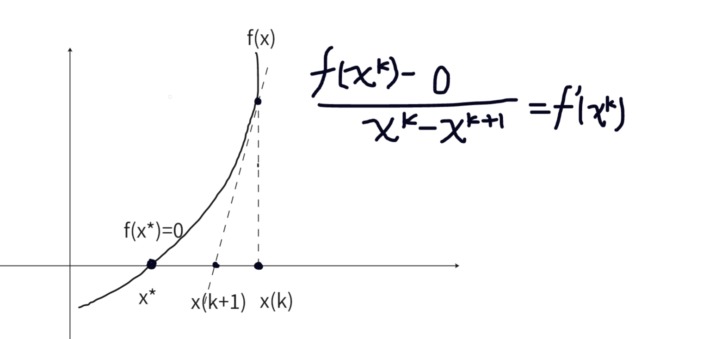

# 非线性方程求解--牛顿迭代法
牛顿法是一种迭代求解方法，核心思想是利用泰勒展开对非线性方程组进行线性化。然后逐步迭代逼近精确解。

比如对于f(x) = a
如果图像如下所示:
  
那么，如果初始值为x(k)，那么x(k+1)是更靠近x*的。
可以计算
$$ x_{n+1} = x_n - \frac{f(x_n)}{f'(x_n)} $$  

然后逐步迭代下去就可以了。

使用样例: 如何手动实现sqrt(n)?    
可以使用牛顿迭代法进行求解：   
>sqrt(n) 可以理解为 x2 - n = 0,然后求得解。

